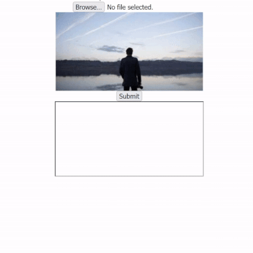

<h1 align="center">Tesseract Image-to-Text Converter</h1>

  

This project is a basic HTML web page that allows users to upload an image file, which is then processed using Tesseract.js to extract the text content from the image.

## What I Learned

- How to integrate Tesseract.js into a web application
- Handling file uploads in HTML forms
- Asynchronous processing of image data

## Technologies Used

- HTML
- JavaScript
- Node.js
- Tesseract.js
- Multer

## Usage

To get a local copy of the project, follow these steps:

1. Clone the repository: `git clone https://github.com/flavioramses/Tesseract.js-practice.git`
2. Navigate to the project directory: `cd Tesseract.js-practice`
3. Install the required dependencies by running `npm install`
4. Start the local server with `npm start`. This will start the server on `localhost:3020`.
5. Open your web browser and navigate to `localhost:3020`.
6. You will see the web page with a file input field. Click on the "Browse" button to select an image file from your local system.
7. After selecting the image, its preview and the extracted text will be displayed on the page.

Note: The project requires an internet connection to fetch the Tesseract.js library.
